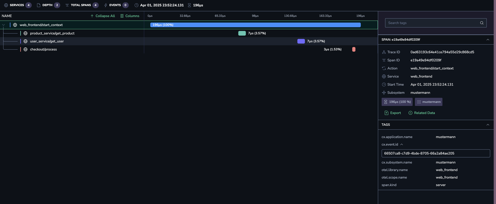

# mustermann


<br />


Mustermann is a CLI tool that generates test data for OpenTelemetry pipelines using a custom virtual machine. It allows you to define complex service interactions and log patterns through YAML configuration files, making it perfect for testing and validating your observability infrastructure.

## Features

- Generate realistic test data for OpenTelemetry pipelines
- Define service interactions and dependencies
- Create custom log patterns with variable substitution
- Control execution frequency and patterns
- Support for different log severity levels
- Custom virtual machine for efficient execution

## Installation

```bash
cargo install mustermann
```

Or install it from the [releases page](https://github.com/schultyy/mustermann/releases).

## Usage

```bash
mustermann [OPTIONS] <file_path> [otel_endpoint] [--service-name <service_name>]
```

### Options

- `-p, --print-code`: Enable debug mode to print generated bytecode
- `-s, --service-name <service_name>`: The name of the service to be used in the logs (default: "mustermann")
- `file_path`: Path to the configuration YAML file
- `otel_endpoint`: Optional OpenTelemetry endpoint URL

### Example

```bash
mustermann config.yaml http://localhost:4317 --service-name my-service
```

## Configuration

### Log Configuration

Define log patterns and their execution behavior:

```yaml
- task_name: App Logs
  frequency: Infinite
  template: "User %s logged in"
  vars:
    - Franz Josef
    - 34
    - Heinz
  severity: INFO
- task_name: App Login Errors
  frequency: Amount(45)
  template: "Failed to login: %s"
  vars:
    - Invalid username or password
    - Upstream connection refused
  severity: ERROR
```

### Service Configuration

Define interconnected services and their interactions:

```yaml
logs: []
services:
  - name: checkout
    methods:
      - name: process
        stdout: Processing Order
        sleep_ms: 100
  - name: user_service
    methods:
      - name: get_user
        stdout: Getting user
        sleep_ms: 100
  - name: product_service
    methods:
      - name: get_product
        stdout: Getting product
        sleep_ms: 100
  - name: web_frontend
    methods:
      - name: start_checkout
        stdout: Starting checkout
        calls:
          - name: product_service
            method: get_product
          - name: user_service
            method: get_user
          - name: checkout
            method: process
        sleep_ms: 100
    invoke:
      - start_checkout
```

- Services can invoke each other's methods. 
- If no `invoke` is specified, the service just runs in an infinite loop, waiting for invokations.



## License

MIT
